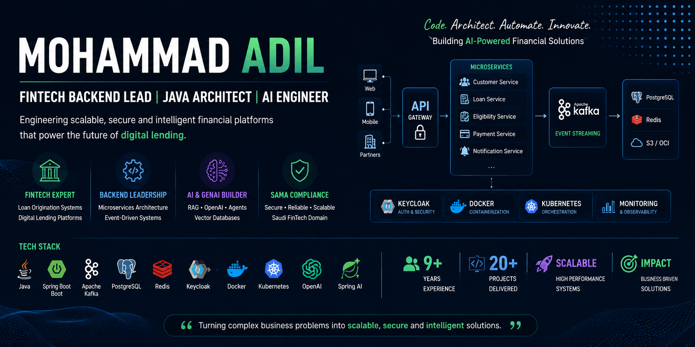

  

Hi, I'm **Mohammad Adil** 👋

**FinTech Backend Lead | Java Architect | AI Engineer**

I am a backend engineering leader with 9+ years of experience building scalable, event-driven financial platforms and Loan Origination Systems (LOS) within the Saudi Arabian fintech ecosystem.

🚀 **What I Do**

    Design and build large-scale microservices using Java & Spring Boot

    Architect event-driven systems using Apache Kafka

    Lead Loan Origination System (LOS) development

    Integrate financial services, including Nafath, SIMAH, Lean, LMS, and payment gateways

    Build AI-powered financial assistants using Spring AI, OpenAI, RAG, and Vector Databases

🏦 **FinTech Domain Expertise**

    Loan Origination Systems (LOS)

    Eligibility & Risk Assessment

    Contract Lifecycle Management

    Customer Onboarding & Verification

    Loan Disbursement Workflows

    SAMA Compliance

    Payment Integrations

🤖 **AI & GenAI**

    Spring AI

    OpenAI

    Retrieval-Augmented Generation (RAG)

    Pinecone Vector Database

    Ollama

    AI Agents

    Financial AI Assistants

🛠️ **Tech Stack**

    Java • Spring Boot • Microservices • Kafka • PostgreSQL • Redis • Keycloak • Docker • Kubernetes • AWS • OCI • ELK • Jenkins • Spring AI

📌 **Featured Projects**

    Financial AI Assistant

    Event-Driven Loan Processing Platform

    Kafka Payment Processing Engine

    Spring AI RAG Applications

    FinTech Microservices Architecture

📫 **Connect With Me**

    LinkedIn: 'https://www.linkedin.com/in/adil-azmi/
